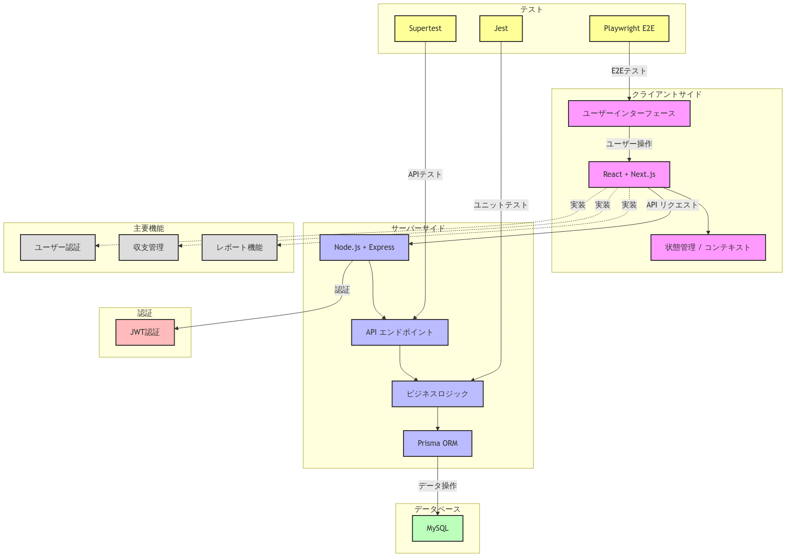

## システム概要
### プロジェクトの目的
学習を初めた初期段階に個人開発用に作成した簡易版家計簿アプリです。
取引データの管理やサマリー機能、そのほかユーザーごとの収支の管理を行うことができます。
### 主要機能
- ユーザー認証:ログイン、ログアウト機能
- 管理機能:ユーザー登録のほか、入力画面標示項目の追加訂正
- 収支管理:収入と支出の記録、詳細（更新削除）
- レポート機能:月次、年次の収支レポート、グラフ表示（円グラフ、棒グラフなど）
### 全体アーキテクチャ図

### 使用技術
- バックエンド: Node.js, Express
- フロントエンド: React, Next.js
- データベース: MySQL (Prisma ORM)
- テスト: Jest, Supertest, End-to-End テスト (E2E) には Playwright を使用